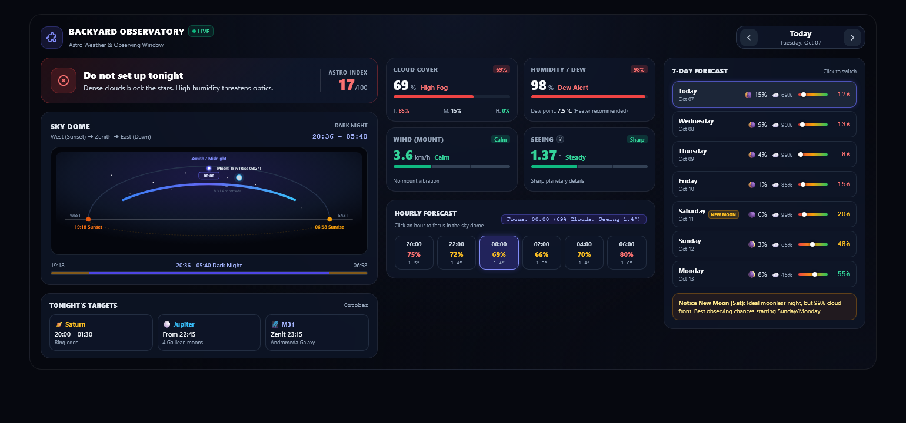
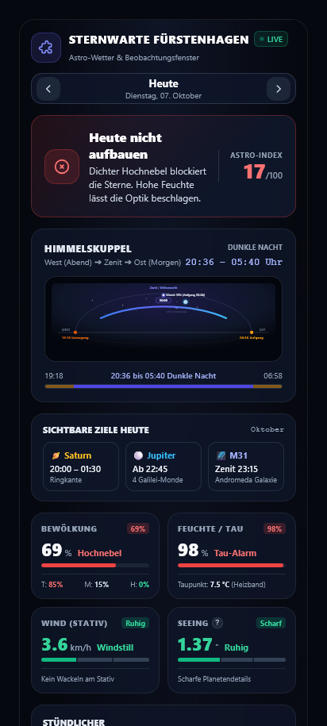

<div align="center">

# 🌌 Astro Weather Card for Home Assistant

**The ultimate astronomical weather and observation planning dashboard for Home Assistant Lovelace.**

[](https://github.com/hacs/default)
[](https://github.com/copystring/astro-weather-card/releases)
[](https://opensource.org/licenses/MIT)
[](https://www.paypal.com/donate/?business=copystring%40gmail.com&currency_code=EUR)
[](https://github.com/copystring/astro-weather-card/graphs/commit-activity)

<br/>



</div>

---

## 🎯 Why Astro Weather Card?

Standard weather apps and generic Lovelace cards are designed for everyday forecasts — not for astronomy. They tell you if it rains tomorrow, but they don't answer crucial observing questions:

* **Is the atmosphere steady or turbulent?** *(Seeing)*
* **Are there thin, high-altitude cirrus clouds blocking astrophotography?** *(Cloud Layers: Low / Mid / High)*
* **Will my telescope corrector plate dew up within 20 minutes?** *(Dew point delta)*
* **Will wind gusts cause mount vibrations and ruin long exposures?** *(Mount stability)*
* **When is true astronomical darkness?** *(Twilight phases)*

**Astro Weather Card** provides the answer in **3 seconds flat**: An immediate verdict hero banner (*"Heute aufbauen"* vs. *"Heute nicht aufbauen"*), backed by deep astronomical telemetry, a dynamic sky dome, interactive night timeline, and a 7-day stargazing forecast.

---

## ✨ Features at a Glance

| Feature | Description |
| :--- | :--- |
| **⚡ 3-Second Verdict Hero** | Instant stargazing recommendation with a clear 0–100 Astro-Index score and plain-English explanation. |
| **🔭 Interactive Sky Dome** | Nocturnal sky arch showing the Zenith at midnight, dynamic Moon position & illumination percentage, sunset/sunrise horizon points, and twilight phases. |
| **⏱️ Interactive Night Scrubber** | Click any hour pill in the timeline to advance the live cursor across the sky dome and inspect hourly conditions. |
| **🌀 Seeing Telemetry** | True atmospheric seeing in arcseconds (`″`) with human-friendly ratings (*Scharf*, *Ruhig*, *Unruhig*) and an integrated "What is Seeing?" explanation popover. |
| **☁️ Integrated Cloud Layers** | Total cloud cover percentage plus a clean sub-breakdown for low, medium, and high clouds directly inside the card. |
| **💧 Dew Point & Moisture Alert** | Proactive warning when high relative humidity threatens optical surfaces, indicating when dew heaters are required. |
| **💨 Mount & Tripod Stability** | Classifies wind speeds specifically for telescope setups (*Windstill*, *Kein Wackeln*, *Mäßig*, *Sturmböen*). |
| **🪐 Tonight's Celestial Targets** | Quick guide to prominent planets and deep-sky objects visible tonight (e.g. Saturn, Jupiter, M31 Andromeda Galaxy). |
| **📅 7-Day Observation Forecast** | Day-by-day stargazing outlook with slider bars, moon phases, and smart advisories (e.g. New Moon rain warnings). |
| **📱 Native & Offline** | Built with pure Custom Web Components & Shadow DOM. Zero external CDN dependencies, fully offline, and auto-adapts from mobile phones to ultrawide monitors. |

---

## 📱 Mobile Experience

The card automatically transitions into a fluid, single-column command center on smartphones and tablets without horizontal clipping or awkward scrolling:

<div align="center">
  
</div>

---

## 📦 Installation

### Method 1: HACS (Recommended)

1. Open **HACS** in your Home Assistant interface.
2. Click the three vertical dots (**⋮**) in the top right corner and select **Custom repositories**.
3. In the dialog, paste the repository URL:
   ```text
   https://github.com/copystring/astro-weather-card
   ```
4. Choose **Dashboard** as the category and click **Add**.
5. Find **Astro Weather Card** in your HACS list and click **Download**.
6. Refresh your browser (or press `Ctrl` + `F5`).

### Method 2: Manual Installation

1. Download `astro-weather-card.js` from the [latest GitHub release](https://github.com/copystring/astro-weather-card/releases).
2. Copy the file into your Home Assistant directory: `/config/www/astro-weather-card.js`.
3. In Home Assistant, go to **Settings** ➔ **Dashboards** ➔ **Resources** (top right three dots).
4. Click **Add Resource**, enter `/local/astro-weather-card.js` and select **JavaScript Module**.
5. Reload your frontend.

---

## ⚙️ Configuration

### Minimal Setup

If you have the popular [AstroWeather](https://github.com/mawinkler/astroweather) integration or standard weather sensors, the card works with zero configuration:

```yaml
type: custom:astro-weather-card
```

### Full Configuration Example

```yaml
type: custom:astro-weather-card
title: "Sternwarte Fürstenhagen"
weather_entity: weather.astroweather
seeing_entity: sensor.astroweather_backyard_seeing
wind_entity: sensor.astroweather_backyard_10m_wind_speed
humidity_entity: sensor.astroweather_backyard_2m_relative_humidity
dewpoint_entity: sensor.astroweather_backyard_2m_dewpoint
condition_entity: sensor.astroweather_backyard_condition
cloud_low_entity: sensor.astroweather_backyard_cloud_low
cloud_mid_entity: sensor.astroweather_backyard_cloud_mid
cloud_high_entity: sensor.astroweather_backyard_cloud_high
```

### Options Reference

| Parameter | Type | Default | Description |
| :--- | :--- | :--- | :--- |
| `type` | `string` | **Required** | Must be `custom:astro-weather-card` |
| `title` | `string` | `Astro-Wetter` | Custom title shown in header (falls back to Home Assistant location name) |
| `weather_entity` | `string` | `weather.astroweather` | Primary weather entity providing meteorological forecasts |
| `seeing_entity` | `string` | *auto* | Sensor reporting atmospheric seeing in arcseconds (`″`) |
| `wind_entity` | `string` | *auto* | Sensor reporting wind speed in `km/h` |
| `humidity_entity` | `string` | *auto* | Sensor reporting relative humidity in `%` |
| `dewpoint_entity` | `string` | *auto* | Sensor reporting dew point temperature in `°C` |
| `condition_entity` | `string` | *auto* | Sensor reporting 0–100 observation suitability score |
| `language` | `string` | *auto* | UI language (`en`, `de`). Automatically detects your Home Assistant language by default |
| `show_targets` | `boolean` | `true` | Show or hide tonight's visible targets card |
| `show_forecast` | `boolean` | `true` | Show or hide the 7-day observation forecast |

---

## 🛠️ Development & Building

```bash
# Clone the repository
git clone https://github.com/copystring/astro-weather-card.git
cd astro-weather-card

# Install dependencies
npm install

# Build release bundle
npm run build
```

---

## ☕ Support the Project

If this card helps you plan your stargazing nights or astrophotography sessions, you can support its ongoing development:

[](https://www.paypal.com/donate/?business=copystring%40gmail.com&currency_code=EUR)

Every coffee helps keep the project maintained and updated with new features! 🔭🌟

---

## 📄 License

This project is licensed under the [MIT License](LICENSE) © 2026 copystring.
